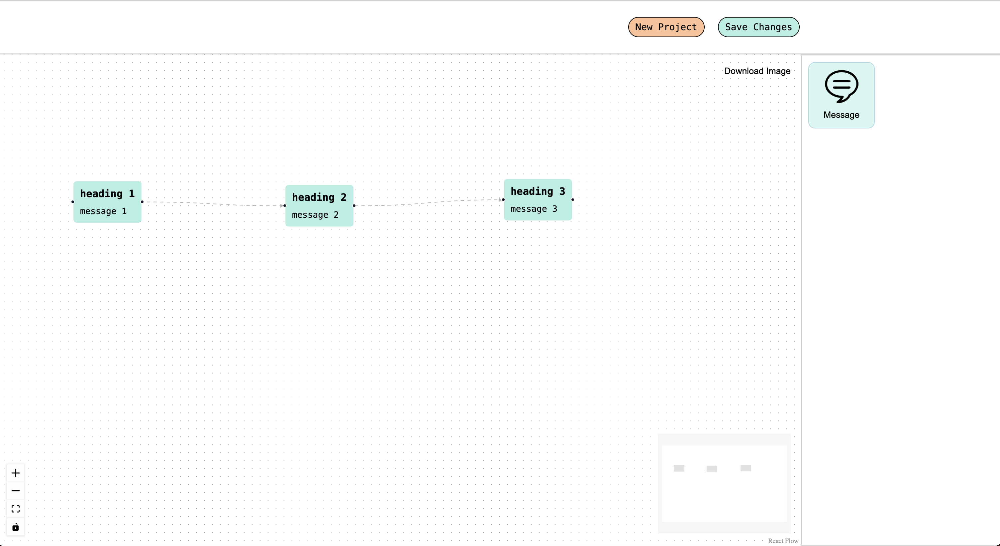
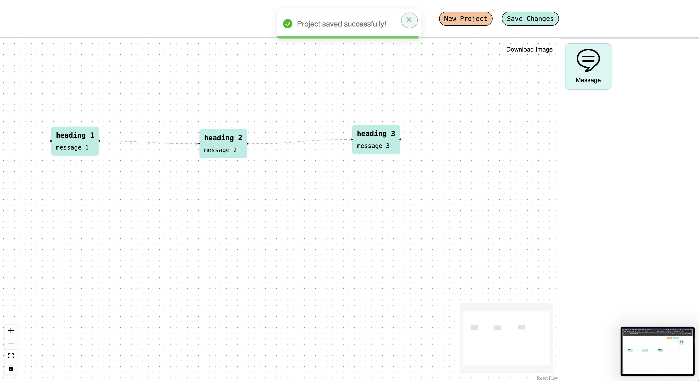
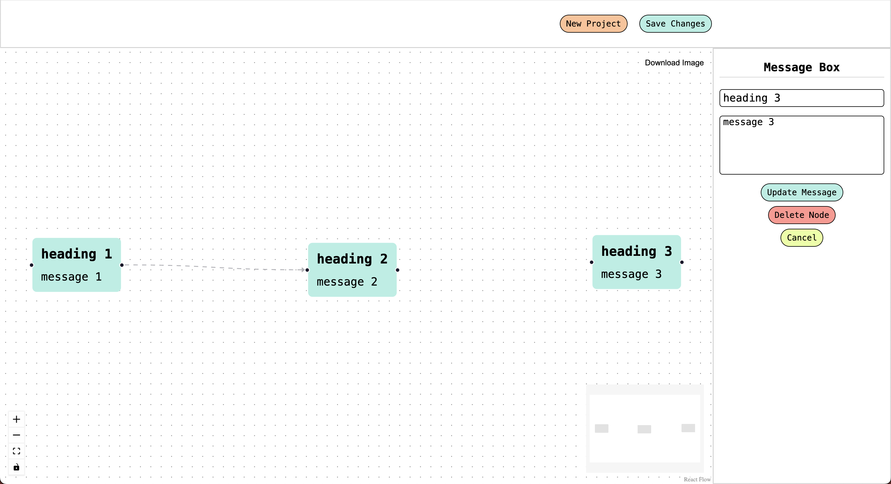

# [Chatbot Flow Builder 🛫](https://naveen-workflow.web.app/)

This project is a simple Chatbot Flow Builder built using React and Vite, with extensibility in mind to easily add new features. It allows users to create chatbot flows by connecting multiple messages together to determine the order of execution.

## Features

- **Text Node**: Users can create text nodes which represent messages in the chatbot flow.
- **Nodes Panel**: Houses all types of nodes that the Flow Builder supports. Currently, it only supports text nodes, but it's designed to be extensible for adding more types of nodes in the future.
- **Edge**: Connects two nodes together to establish the flow of conversation.
- **Source Handle**: The starting point of a connecting edge. Each source handle can only have one edge originating from it.
- **Target Handle**: The endpoint of a connecting edge. Each target handle can have more than one edge connecting to it.
- **Settings Panel**: Replaces the Nodes Panel when a node is selected. It includes a text field to edit the text of the selected text node.
- **Save Button**: Allows users to save the created flow. If there are more than one node and more than one node has empty target handles, pressing the save button will show an error message.

## Technologies Used

- React: Used as the primary framework for building the UI components and managing state.
- Vite: Used for project setup and development environment.
- React Flow (https://reactflow.dev/): Utilized for creating the flow builder interface.
- Other libraries: Additional libraries may be used for specific features or enhancements.

## Screenshots

### Main Page

### Saved 

### Update form

## How to Use

1. **Installation**: Clone the repository and install dependencies by running `npm install` or `yarn install`.
2. **Run**: Start the development server by running `npm run dev` or `yarn dev`.
3. **Usage**: Use the interface to drag and drop text nodes onto the flow canvas, connect them with edges, and configure their settings as needed.
4. **Save**: Once the flow is created, click the save button to save the flow. Ensure that each node has at least one target handle connected to it to avoid errors.
